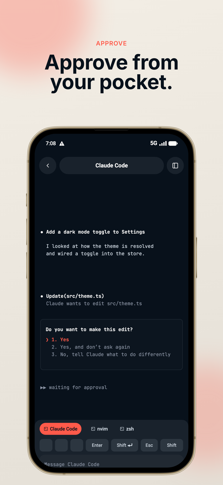
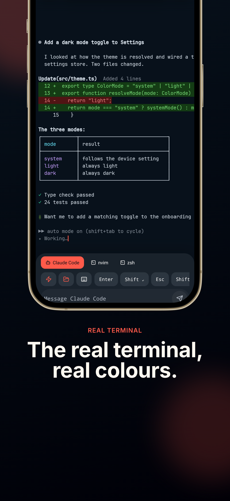
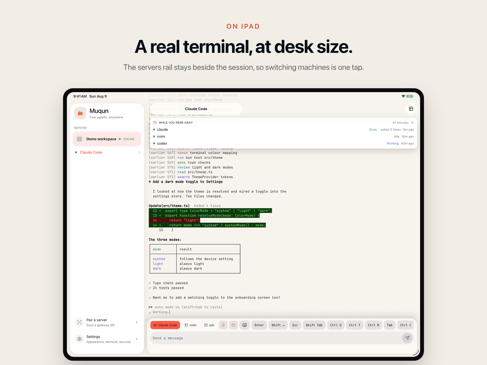

# Muqun

**Watch and answer the coding agents running on your own computer, from your phone.**

You start an agent, it says twenty minutes, and you go and make coffee. Eight
minutes in it stops to ask whether it may delete a file — and then it sits
there, doing nothing, until you are back at the keyboard.

Muqun is the other half of that session. The question arrives as a push you can
answer from the Lock Screen, and behind it is the real terminal: the same grid,
the same colours, the same keys, on a phone or an iPad.

It talks to a [Gateway](https://github.com/osuki-dev/muqun-gateway) you install
on your own machine. There is no Muqun account, no hosted relay, no analytics
and no advertising, and nothing of yours passes through a server of ours —
because there isn't one.

| Approve from wherever you are | The real terminal, not a log view |
| --- | --- |
|  |  |



## What it does

- **Answers the question.** The permission prompt arrives as a push —
  Approve, Approve always, Deny — from the Lock Screen, without opening the
  app. On iOS a Live Activity keeps the panel you are watching on screen; on
  Android there is a home-screen widget.
- **Draws a real terminal.** Output goes onto a terminal grid in the program's
  own colours, so diffs, tables, spinners and TUIs look the way they look on
  your desk. Long-press to select and copy the exact bytes.
- **Sends real keys.** The on-screen row is laid out like a keyboard and every
  key sends the moment you press it, so nvim, `less` and REPLs behave. Editor
  panels get vim's key row and follow nvim's current mode.
- **Finds its way around a busy machine.** One sheet outlines the whole
  workspace — every tab, every panel, addressed the way tmux addresses it — and
  you can open a port on that machine in your phone's browser.
- **Starts the next one.** Pick an agent, pick a directory the session already
  knows, type or dictate the prompt; Muqun opens the panel it just made.
- **Looks like your setup.** 32 theme packs, each with a light half and a dark
  one, repainting the app and the terminal together. Eight languages: English,
  繁體中文, 日本語, 한국어, Deutsch, Français, Español, Português.

No Gateway yet? "Try the demo" on the home screen runs the whole app on sample
data bundled in the binary, offline, with no network request of any kind.

## Get it

<p align="center">
  <a href="https://apps.apple.com/app/muqun/id6793419283"></a>
  <a href="https://play.google.com/store/apps/details?id=dev.osuki.muqun"></a>
</p>

<p align="center">
  <sub>
    iOS 16.4 or later · one purchase, every update after it free · no account, no subscription
  </sub>
</p>

<!--
  The two badges are the stores' own artwork, kept in `assets/readme/` rather
  than hotlinked, so a fork, a mirror or an offline clone renders the same page.

  Google ships its badge with 32.8% of the image height as transparent padding
  (the button is 564x168 inside a 646x250 file); Apple ships its with none. The
  copy here is trimmed to that ink box, so both files are the button and nothing
  else and both can be set to the same height.

  Do not "fix" this by giving Google's badge a taller height instead. GitHub
  strips `style` from README HTML, so there is no vertical-align to reach for,
  and two inline images sit on one baseline: a padded badge scaled up until its
  button matches leaves that button floating about 12px above the other one.
  That was the first version of this block and it is what it looked like.

  Both anchors are written with no whitespace inside them, on purpose. A newline
  between `` and `</a>` is a text node inside a link, and GitHub underlines
  it -- a small blue dash hanging off the App Store badge.

  Muqun is not sold in the mainland China storefront. The link carries no
  country segment, so Apple sends each visitor to their own storefront and a
  visitor in one that does not sell it lands on Apple's front page. That is the
  storefront, not a dead link, and hardcoding /us/ would break it for everyone
  else.
-->

Other ways in:

- **APK, no store account** — CI builds a sideloadable APK for every tag and
  attaches it to that tag's [release](https://github.com/osuki-dev/muqun-app/releases)
  (`.github/workflows/android-apk.yml`). It is the same app as the Play build —
  same `dev.osuki.muqun` applicationId, same everything, just packaged as an APK
  instead of an App Bundle. Because Android identifies an install by
  applicationId *and* signature, and Play re-signs its own artifact, the two
  cannot sit on one phone: moving between them means uninstalling first, which
  takes the paired Gateways with it. Pick one and stay on it.
- **Or build it yourself** — see [below](#build-it-from-source).

## What you need to run it

One computer you own, running **macOS or Linux**, with **tmux** or
[**Herdr**](https://github.com/ogulcancelik/herdr) 0.7.5 or newer on it.
Windows is not supported yet.

On that machine:

```sh
curl -fsSL https://osuki.dev/muqun/gateway.sh | sh
```

That downloads a ready-built Gateway — no Rust toolchain, no compiler —
configures it, starts it, and opens a pane with a pairing QR already in it.
Point the app's camera at that QR and type back the short code your computer
shows. If the pane is not there, `muqun-gateway manage` opens it from any
terminal.

The two devices need a route to each other. The same Wi-Fi works. We recommend
putting both on [Tailscale](https://tailscale.com) and using Tailscale Serve for
a private HTTPS address: no port forwarding, and nothing of yours on the public
internet. Traffic between the app and the Gateway is encrypted end to end,
including the live event stream, and pairing credentials are held in the
platform keystore.

The Gateway is a separate project, in Rust, under the MIT licence:
[osuki-dev/muqun-gateway](https://github.com/osuki-dev/muqun-gateway).

## Build it from source

You need [Bun](https://bun.sh) (CI pins 1.3.14) and the native toolchain for
whichever platform you are building — Xcode for iOS, Android Studio and a JDK
for Android.

```sh
bun install
bun run ios        # or: bun run android
```

`ios/` and `android/` are generated from `app.json` and `plugins/`, and are not
tracked; `bun run ios` prebuilds them for you. **Expo Go will not run this
app** — it depends on native modules that are not in that sandbox, so the first
build has to be a development build.

Then, without a Gateway anywhere:

```sh
bun run mock:gateway   # a fake Gateway on :7347, pairing code MUQ2-3456
```

Or skip pairing entirely and tap "Try the demo".

The checks, all of which must pass:

```sh
npx tsc --noEmit
bun run lint           # expo lint --max-warnings 0; a warning fails the run
bun test src
bash scripts/e2e.sh    # Maestro, offline, needs one booted device with the app installed
```

## How the repo is laid out

```text
src/app/          Expo Router routes; deliberately thin
src/components/   screens, sheets, terminal UI, controls
src/hooks/        the adapters between stores/services and components
src/stores/       Zustand state, hydration, persistence boundaries
src/lib/          pairing, encrypted gateway transport, notifications, widgets, domain helpers
src/terminal/     the VT parser, the screen model, and the Skia renderer
src/constants/    design tokens, the 32 theme packs, stable configuration
src/i18n/         Lingui setup and the eight locale catalogs
plugins/          Expo config plugins for the native projects
maestro/          end-to-end flows and reusable subflows
scripts/          mock gateway, benchmarks, soak tests, the e2e runner
assets/           fonts, icons, bundled media
```

[`CONTEXT.md`](CONTEXT.md) is the longer map — data flow, the patterns worth
knowing, and the sharp edges. [`AGENTS.md`](AGENTS.md) is what a coding agent
working in this tree is told.

## Contributing

Issues and pull requests are welcome here, and there are
[templates](.github/ISSUE_TEMPLATE) for the three shapes a report usually takes.
The Feedback button in Settings opens this tracker.

The bug form asks one question worth answering carefully: whether the problem
also happens in the offline demo. It runs on data bundled in the binary and
makes no network requests, so a bug that reproduces there is in the app and
nothing about your machine, your network or your Gateway can be the cause. That
one answer decides where a report goes next.

A few things that will save you a round trip:

- Run `npx tsc --noEmit`, `bun run lint` and `bun test src` before you open the
  pull request. If the change touches a screen, run `bash scripts/e2e.sh` too
  and add a flow for whatever surface is new.
- Pure logic goes in a helper that Bun can test without a native module. That is
  why `src/lib` and `src/terminal` are as large as they are.
- User-facing strings are Lingui macros. Add English, run `bun run i18n`, and
  leave the other seven catalogs to a translator rather than to a guess.
- Accessibility labels and test IDs are automation contracts. Renaming one
  breaks a Maestro flow.
- The app must keep working against an older Gateway. New endpoints go behind
  the capability gate in `src/lib/herdr-compatibility.ts`.

Contributions are accepted under Apache-2.0, per section 5 of the licence.
There is no CLA.

## Licence

Apache License 2.0 — see [`LICENSE`](LICENSE) and [`NOTICE`](NOTICE).

**The names and the logo are not covered by that licence.** Fork it, build it,
change it, ship what you build — under your own name. See
[`TRADEMARK.md`](TRADEMARK.md), which is short and says exactly what is and is
not allowed.
